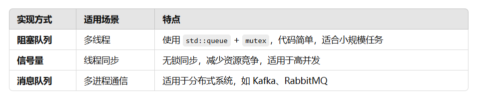

# 生产者消费者模型

## 概念
生产者-消费者（Producer-Consumer） 是一种典型的并发编程模型，它用于解决在多线程环境下数据共享的问题。
它包含两个主要角色：
* 生产者（Producer）：负责生产数据，并将其放入缓冲区（队列）。
* 消费者（Consumer）：从缓冲区中取出数据并进行处理。+

## 核心目标
* 解耦生产者和消费者，使得两者独立运行。
* 支持异步处理，提高系统吞吐量。
* 避免资源争用，防止数据丢失或重复处理。
* 平衡生产与消费速率，防止过载或资源浪费。

## 基本工作流程
1. 生产者创建数据，并将其存入**缓冲区（队列）**。
2. 消费者从缓冲区获取数据，并进行处理。
3. 若缓冲区**满**，生产者需等待（避免溢出）。
4. 若缓冲区**空**，消费者需等待（避免无数据可用）。
5. 生产者和消费者通常运行在不同的线程或进程中。

## 实现方式
### 方式1：使用互斥锁（Mutex）+条件变量（Condition Variable）

适用于： 多线程场景，需要保证线程安全。

实现逻辑
* 生产者在缓冲区未满时生产数据，满时等待。
* 消费者在缓冲区不为空时消费数据，空时等待。
* 使用 **互斥锁（Mutex**） 确保生产和消费操作的原子性。
* 使用 **条件变量（Condition Variable）** 实现线程间同步。

测试用例（C++）
```
#include <iostream>
#include <queue>
#include <thread>
#include <mutex>
#include <condition_variable>

std::queue<int> buffer;
const int MAX_BUFFER_SIZE = 10;

std::mutex mtx;
std::condition_variable cv_producer, cv_consumer;

void producer() {
    int data = 0;
    while (true) {
        std::unique_lock<std::mutex> lock(mtx);
        cv_producer.wait(lock, []{ return buffer.size() < MAX_BUFFER_SIZE; }); //这一步使用生产者条件变量 cv_producer 进入等待状态，直到缓冲区 buffer 中的元素数量小于 MAX_BUFFER_SIZE

        buffer.push(++data);
        std::cout << "Produced: " << data << std::endl;

        cv_consumer.notify_one();  // 通知消费者唤醒一个正在等待的消费者线程，提示它可以从缓冲区中消费数据了
    }
}

void consumer() {
    while (true) {
        std::unique_lock<std::mutex> lock(mtx);
        cv_consumer.wait(lock, []{ return !buffer.empty(); }); //等待，直到缓冲区不为空

        int data = buffer.front();
        buffer.pop();
        std::cout << "Consumed: " << data << std::endl;

        cv_producer.notify_one();  // 通知生产者
    }
}

int main() {
    std::thread t1(producer);
    std::thread t2(consumer);
    t1.join();
    t2.join();
    return 0;
}
```
**关键点**
* std::mutex 保证线程安全，防止多个线程同时访问缓冲区。
* std::condition_variable 用于线程同步，避免忙等（busy-waiting）。
* cv.wait() 阻塞线程，直到条件满足。

### 方式2：基于阻塞队列（Blocking Queue）
适用于： 更高级的线程管理，避免手动处理锁和条件变量。

**测试用例(C++)**
```
#include <iostream>
#include <queue>
#include <thread>
#include <mutex>
#include <condition_variable>
#include <chrono>

template <typename T>
class BlockingQueue {
private:
    std::queue<T> queue;
    std::mutex mtx;
    std::condition_variable cv_producer, cv_consumer;
    size_t max_size;

public:
    explicit BlockingQueue(size_t size) : max_size(size) {}

    void push(T item) {  //生产者push()
        std::unique_lock<std::mutex> lock(mtx);
        cv_producer.wait(lock, [this] { return queue.size() < max_size; }); // 队列满时阻塞

        queue.push(item);
        std::cout << "Produced: " << item << std::endl;

        cv_consumer.notify_one();
    }

    T pop() {  //消费者pop()
        std::unique_lock<std::mutex> lock(mtx);
        cv_consumer.wait(lock, [this] { return !queue.empty(); }); //队列空时阻塞

        T item = queue.front();
        queue.pop();
        std::cout << "Consumed: " << item << std::endl;

        cv_producer.notify_one();
        return item;
    }
};

void producer(BlockingQueue<int>& q) {
    for (int i = 1; i <= 10; ++i) {
        q.push(i);
        std::this_thread::sleep_for(std::chrono::milliseconds(500));
    }
}

void consumer(BlockingQueue<int>& q) {
    for (int i = 1; i <= 10; ++i) {
        q.pop();
        std::this_thread::sleep_for(std::chrono::milliseconds(1000));
    }
}

int main() {
    BlockingQueue<int> queue(5);
    
    std::thread producer_thread(producer, std::ref(queue));
    std::thread consumer_thread(consumer, std::ref(queue));

    producer_thread.join();
    consumer_thread.join();

    return 0;
}
```


### 方式3：信号量（Semaphore）
**适用场景**
* 控制生产者-消费者的同步，避免竞态条件。
* 适用于资源管理（如限制线程池的最大任务数）。

**核心思想**

使用 两个信号量：
  * empty_slots 记录缓冲区剩余可用空间。
  * full_slots 记录缓冲区中已有数据
  
**关键点**
* empty_slots.acquire() 让生产者在缓冲区满时等待。
* full_slots.acquire() 让消费者在无数据时等待。
* 无锁同步方式，减少锁竞争，提高效率。


## 方式3：基于消息队列（Message Queue）
**适用常见**
* 多进程通信（IPC），适用于分布式系统。
* Kafka、RabbitMQ、Redis队列等内部机制类似。

**核心思想**
* 使用 mqueue 或 boost::interprocess 进行进程间通信（IPC）。
* 生产者 写入消息队列，消费者 读取消息队列。

**关键点**
* message_queue::send() 异步存入数据。
* message_queue::receive() 阻塞获取数据。
* 适用于分布式和多进程应用（如 Kafka、Redis 队列）。


