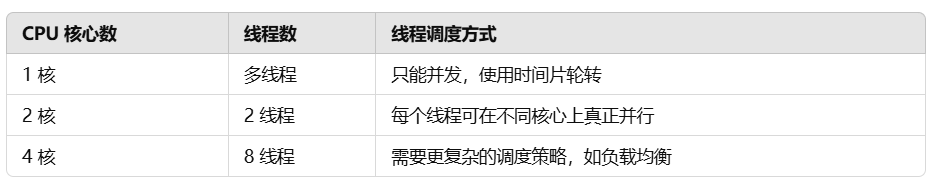

# 进程
进程（Process）是操作系统中资源分配的基本单位，它代表一个正在执行的程序实例。进程由程序代码、数据、打开的文件、系统资源以及执行状态组成。每个进程在操作系统中通常拥有独立的地址空间，并且至少包含一个线程（主线程）。

## 进程的特点
1. 独立性：每个进程都有自己的地址空间，进程之间的内存相互隔离，不能直接访问彼此的数据。
2. 资源分配单位：操作系统为进程分配 CPU 时间、内存、文件句柄等资源。
3. 并发性：多个进程可以在同一个系统中并发执行，即使在单核 CPU 上，也可以通过时间片轮转的方式实现“伪并行”。
4. 调度性：进程的创建、执行、挂起、终止都受到操作系统的调度管理。
5. 开销大：进程的创建、销毁、上下文切换需要操作系统进行大量的资源管理和状态维护，开销较大。

## 进程的生命周期
一个进程通常会经历以下几个阶段：
1. 创建（New）：进程被创建，分配资源。
2. 就绪（Ready）：进程已准备好运行，但等待 CPU 进行调度。
3. 运行（Running）：进程获得 CPU 时间并执行代码。
4. 阻塞（Blocked）：进程等待 I/O 设备或其他资源，不可运行。
5. 终止（Terminated）：进程执行完毕或被强制终止，释放资源。

# 线程
线程是操作系统调度的基本单位，它是进程中的一个执行流。一个进程可以包含多个线程，这些线程共享相同的地址空间和资源，但它们可以独立调度和执行。

## 线程的特点
1. 共享资源：同一进程的所有线程共享进程的地址空间、文件句柄、全局变量等资源。
2. 独立执行：每个线程都有自己的程序计数器（Program Counter, PC）、寄存器和栈，不同线程可以执行不同的任务。
3. 更轻量：创建、销毁线程比进程开销小，线程切换比进程切换更快。
4. 并发执行：多个线程可以并发运行，提高 CPU 利用率，特别适用于多核 CPU。
5. 可能的竞争问题：由于多个线程共享同一进程的资源，可能会发生竞争条件（Race Condition），导致数据不一致。

## 线程的分类
线程主要分为 内核线程 和 用户线程：
1. 内核线程（Kernel Thread）
    * 由操作系统内核管理，线程的调度由内核完成。
    * 线程切换需要操作系统进行模式切换（用户态 → 内核态），效率相对较低。
    * 适用于多核 CPU 计算、高性能并发应用。
1. 用户线程（User Thread）
    * 由用户态的线程库（如 pthread）管理，而不是操作系统。
    * 线程切换不需要内核介入，效率高，但如果一个用户线程被阻塞，整个进程可能会被阻塞。
    * 适用于轻量级任务管理，如 Java 线程、Python 线程。

## 线程的生命周期
线程的生命周期可以分为以下几个阶段：
1. 创建（New）：线程被创建，尚未执行。
2. 就绪（Ready）：线程已准备好运行，等待 CPU 调度。
3. 运行（Running）：线程正在执行。
4. 阻塞（Blocked）：线程等待 I/O 资源或其他线程释放锁，暂时不能执行。
5. 终止（Terminated）：线程执行完毕或被强制终止。

## 线程的调度
线程调度是操作系统决定哪个线程先运行的过程，调度方式包括：
1. 抢占式调度（Preemptive Scheduling）：操作系统可以随时暂停一个线程，切换到另一个线程。
    * 时间片轮转（Round Robin）：每个线程按顺序运行固定时间，然后切换到下一个线程。
    * 优先级调度（Priority Scheduling）：优先级高的线程会被优先执行。
2. 协作式调度（Cooperative Scheduling）：线程主动让出 CPU 资源，其他线程才能运行。
    * 先来先服务（First Come First Serve, FCFS）：线程按照创建的顺序依次执行，先到的线程先执行，直到运行结束或被阻塞。
    * 短任务优先（Shortest Job Next, SJN）：选择执行时间最短的线程优先执行，以减少平均等待时间
    * 最高响应比优先（Highest Response Ratio Next, HRRN）：计算响应比 R=（等待时间+执行时间）/执行时间，选择最高的线程执行。
    
    

## 线程的同步与通信
由于线程共享同一进程的资源，因此需要同步机制来防止数据竞争：
1. 互斥锁（Mutex）：确保同一时刻只有一个线程访问临界区。
2. 信号量（Semaphore）：控制多个线程对共享资源的访问数量。
3. 条件变量（Condition Variable）：线程间通信，通知某个线程状态变化。
4. 读写锁（RWLock）：允许多个线程同时读取数据，但写操作需要独占锁。

线程间的通信方式：
1. 共享变量（最常见，但需要同步机制）
2. 消息队列（如生产者-消费者模式）
3. 管道（Pipe）
4. 事件（Event）

## 线程与CPU核心的关系
线程的执行最终依赖于 CPU 核心（Core），不同调度方式对线程和核心的映射关系不同：
1. 单核 CPU
    * 由于只有一个核心，多个线程只能 **并发** 执行，而**非真正**的并行。
    * 操作系统使用时间片轮转等方式在不同线程之间切换，让它们“看起来”是同时执行的。
2. 多核 CPU
    * 多个线程可以**真正 并行** 执行，每个核心可以同时运行一个线程。
    * 线程调度器需要考虑：
        * 线程绑定（Affinity）：是否将某个线程固定在某个核心上（提升缓存命中率）。
        * 负载均衡（Load Balancing）：如何合理分配线程给不同核心，提高整体吞吐量。
### 映射关系

示例
1. 单线程进程 运行在单核 CPU 上 → 只能利用一个核心。
2. 多线程进程 运行在多核 CPU 上 → 可真正并行，但受限于调度策略。
3. 超线程（Hyper-Threading, HT） 技术可以让一个物理核心同时执行两个逻辑线程，提升 CPU 利用率。

## 总结

# 协程
协程（Coroutine）是一种比线程更轻量级的并发执行单元，它允许程序在执行过程中主动挂起并恢复，而无需操作系统的线程调度。与线程不同，协程通常在 用户态 运行，由程序自身进行调度，而不是依赖内核调度。

## 协程的特点
1. 用户态调度：不依赖操作系统，切换成本极低。
2. 非抢占式调度：协程不会被强行打断，而是主动让出 CPU 资源。
3. 轻量级：一个线程可以运行数万个协程，而不会像线程那样消耗大量内存。
4. 适用于 I/O 密集型任务：如网络请求、数据库查询等。

